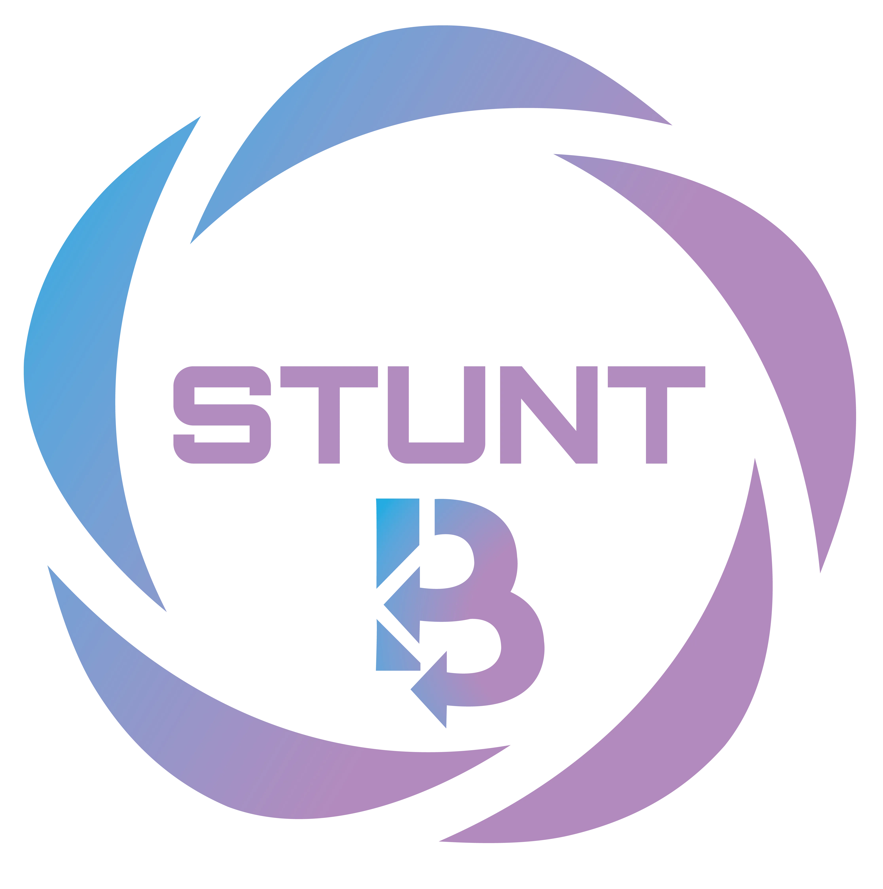
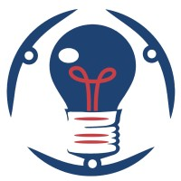

# Projet YEKOLA

    
    

Yekola est un projet OpenSource visant le territoire Congolais.  Ce projet a été initié par **Stunt Business Inc.** en collaboration avec les étudiants du Groupe de **Génie Électrique et Informatique de l'Université de Kinshasa**. 

Notre prémière rencontre a eu lieu sur le Vendredi **30 mai 2025** et le début de travaux est fixé du **15 juin 2025** au **15 juin 2026**. 

- Lien de la présentation: https://drive.google.com/file/d/1Omscz11EZzk-PGF-Gk4oMIWr3I8n3M_6/view?usp=sharing
- Vidéo de la présentation: https://drive.google.com/file/d/1sjserhwwo3fLnUkIio4aw5oAPdddPdL1/view?usp=sharing

# Pile technologie 

L'application est développé avec les technologies suivantes:

- Laravel pour le backend: https://laravel.com/
- VueJs pour le frontend: https://vuejs.org/guide/scaling-up/testing.html
- Github pour le système de controle des versions: https://github.com/

# Horaire de l'implémentation

Le cycle de développement logiciel est suivi pour ce projet. 

### Planification

TODO 

### Design

TODO 
### Implémentation

TODO 
### Test

TODO 
### Déploiement

TODO 

Spreasheet: 

# Horaire des rencontres en vidéoconférence 

TODO

# Contact

Les responsables de ce projet peuvent etre contactés aux adresses suivantes:

- Benjamin Viranga Kataliko: benjamin.kataliko@stuntbusiness.ca, Stunt Business Inc. 
- Daniel Mabanza: mrdanielmabanza@gmail.com 

Veuillez s'il vous plait mettre le docteur Jean-Marie Mbeya (jean-marie.beya@unikin.ac.cd) et Celestin Mudogo (jean-marie.beya@unikin.ac.cd) en CC lorsque vous nous contactez.

# Comment contribuer au projet?

Veuillez suivre les instructions disponibles dans le document ci-dessous:

- https://docs.google.com/presentation/d/1BxnCPTlpnfwqwS0KrWifszgpK4NMnncyCbZcr69mjCU/edit?usp=sharing